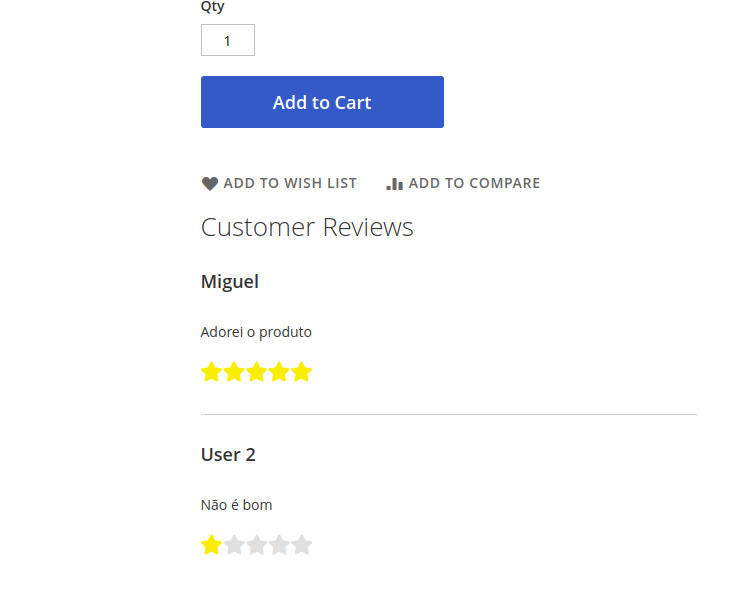

# Techshop Review Module for Magento 2

This Magento 2 module provides review functionality for Techshop's products.

## Features

- Allows users to submit product reviews.
- Admin capability to approve or disapprove reviews.
- Display approved reviews on product pages.

## Installation

### Download the zip:

- Download the zip file from [here 1](https://github.com/miguelfep/tecshop-review/archive/refs/heads/master.zip)
- Extract the zip file
- Copy the extracted code to app/code/Techshop/Review

###  in your Magento installation:


```bash

# Enable the module
php bin/magento module:enable Techshop_Review

# Run Setup Upgrade
php bin/magento setup:upgrade

# (Optional) Deploy static content if in production mode
php bin/magento setup:static-content:deploy
```


## Testing
### Unit Tests
Navigate to the Magento root directory and run:
```bash
vendor/bin/phpunit -c dev/tests/unit/phpunit.xml.dist app/code/Techshop/Review/Test/Unit/
```

## Screenshots

### Review form


### Admin panel


## Review list

